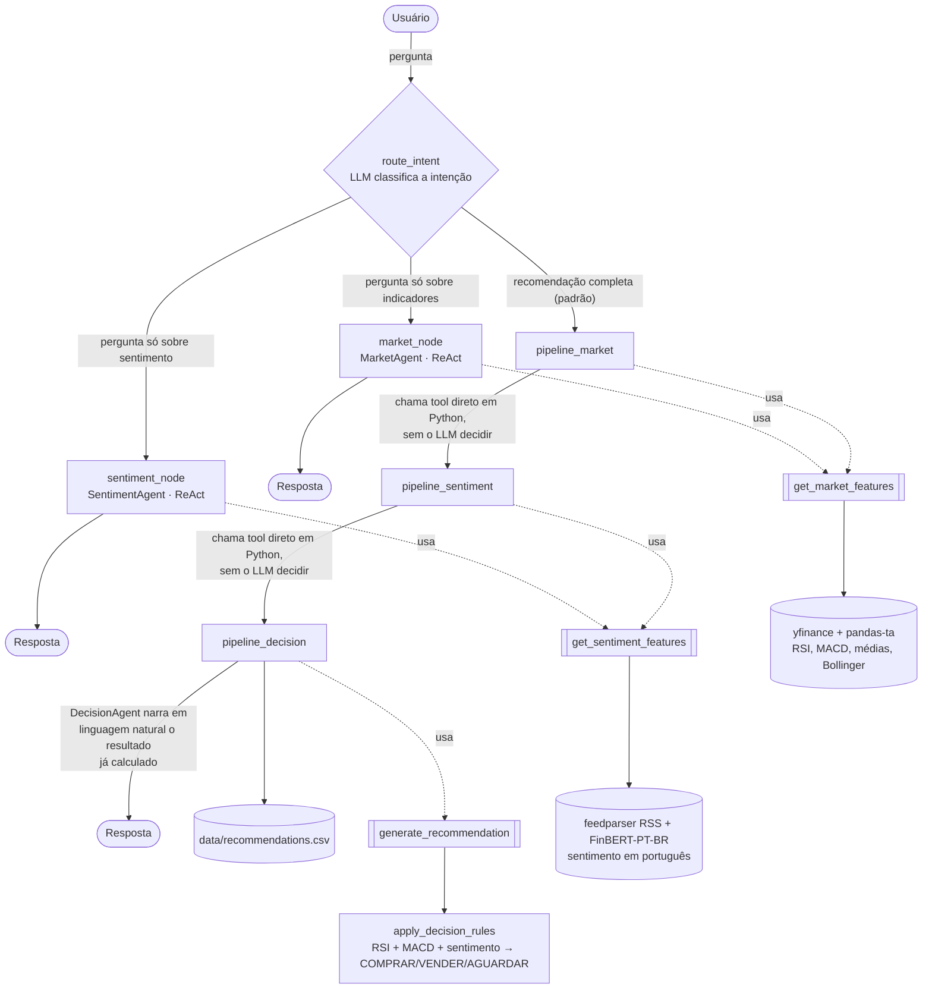
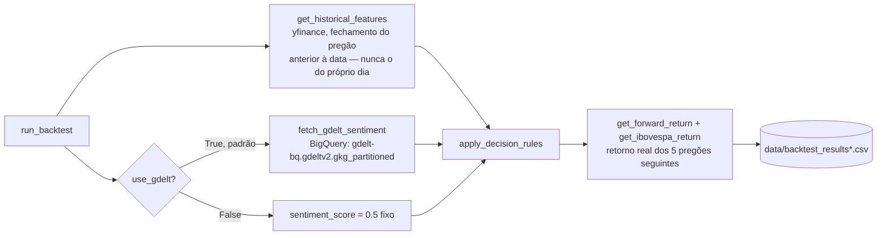

# Arquitetura

Duas partes independentes: o **agente em tempo real** (orquestrador LangGraph, atrás da interface Gradio) e o **backtest histórico** (script Python puro, sem LLM). Eles compartilham os mesmos indicadores técnicos e a mesma lógica de decisão (`apply_decision_rules`), mas rodam separadamente — o backtest nunca chama o agente, e o agente nunca chama o backtest.

## Agente em tempo real

O orquestrador roteia cada pergunta entre 3 destinos, dependendo da intenção classificada pelo LLM. Recomendação completa segue um **pipeline fixo** (tools chamadas direto em Python, sem o LLM decidir se/quando chamá-las); perguntas pontuais usam **ReAct genuíno** (o LLM decide quais tools chamar).

**Por que híbrido:** o pipeline fixo garante que a recomendação completa nunca falhe por o LLM "esquecer" de chamar uma tool ou alucinar um resultado sem dados reais — isso já aconteceu durante o desenvolvimento (ver `docs/progress.md`) quando as 3 etapas eram encadeadas como agentes ReAct passando a conversa acumulada. O roteamento dinâmico para perguntas pontuais não tem esse risco (recebe só a pergunta original, sem histórico acumulado), então pode usar ReAct de verdade.

## Backtest histórico

Roda fora do orquestrador, sem LLM e sem FinBERT — usa só a função pura de decisão, percorrendo cada dia útil do período em ordem temporal (nunca embaralhada, para não introduzir look-ahead bias).

**Por que sem LLM:** narrativa em linguagem natural não agrega valor rodando centenas de vezes num loop histórico — o objetivo do backtest é medir a qualidade do sinal (RSI + MACD + sentimento), não a qualidade da explicação.

Decisões e trade-offs por trás de cada escolha acima (pipeline determinístico, migração para BigQuery, proteção contra look-ahead bias) estão detalhados em [`decisions.md`](decisions.md).
